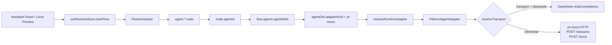

# AgentsFlow

A graph-based flow framework for AI agent orchestration.

## What is AgentsFlow?

AgentsFlow lets you design, validate, and run AI agent workflows as directed graphs — visually in a React-based studio, or programmatically via TypeScript APIs. Flows are authored in YAML, validated with Zod schemas, and executed by a scheduler that respects loop semantics, sub-agent arbitration, and event sourcing.

## Architecture Overview

```text
┌─────────────────────────────────────────────────────────────────┐
│                        Monorepo (pnpm)                          │
├─────────────┬───────────────────────────────────────────────────┤
│  apps/       │  packages/                                       │
│  ├─ desktop  │  ├─ shared-contracts   ← IPC types, DTOs, errors│
│  ├─ web      │  ├─ agent-contracts     ← abstract agent iface  │
│  └─ studio   │  ├─ flow-schema         ← YAML/Zod validation   │
│              │  ├─ flow-engine          ← scheduler & executor  │
│              │  ├─ agent-registry       ← adapter discovery     │
│              │  ├─ local-store          ← SQLite persistence    │
│              │  ├─ platform-adapter     ← IPC / HTTP bridge     │
│              │  ├─ ui-flow              ← React Flow canvas     │
│              │  └─ testing-kit          ← fakes & fixtures      │
└─────────────┴───────────────────────────────────────────────────┘
```

### Dual-Platform Design

AgentsFlow runs in two modes:

| Mode | Transport | Use Case | Entry |
| ---- | --------- | -------- | ----- |
| **Desktop** | Electron IPC (`window.agentsflow`) | Production app, full OS access | `apps/desktop` |
| **Web** | HTTP REST (`fetch`) | Daily dev preview, browser-only | `apps/web` |

Both modes share the same React renderer (`@agentsflow/ui-flow`) and platform abstraction (`@agentsflow/platform-adapter`). The `PlatformProvider` React context auto-detects the runtime and injects the correct backend.

```text
┌──────────────┐     ┌──────────────────┐     ┌──────────────┐
│  apps/desktop │     │  @agentsflow/    │     │  apps/web    │
│  (Electron)   │────▶│  platform-adapter│◀────│  (Vite only) │
│  preload.ts   │     │  ┌─────────────┐ │     │  HTTP fetch  │
│  IPC bridge   │     │  │ PlatformApi  │ │     │  REST API    │
└──────────────┘     │  └──────┬───────┘ │     └──────────────┘
                     │         │         │
                     └─────────┼─────────┘
                               ▼
                     ┌──────────────────┐
                     │  @agentsflow/    │
                     │  ui-flow         │
                     │  (FlowEditor)    │
                     └──────────────────┘
```

### Flow Runtime Binding

The current runtime resolves agent execution in four steps:

1. A graph node selects an `agentId`.
2. The matching `agentDef` selects an `adapterKind`.
3. The runtime adapter registry creates the concrete adapter instance.
4. The adapter chooses its transport, such as a real pi-mono backend or the DeepSeek-compatible transport used by the default starter flow.



Key rules:

- Runtime execution follows `graph.nodes[*].agentId -> agents.agentDefs[*].adapterKind`.
- `layout.nodeBindings` is descriptive layout metadata and must not replace runtime lookup.
- Session reuse happens at runtime per `runId + agentId`, not per node instance.
- Prompt assembly and `turnMode` resolution happen in the engine before the adapter call.

## Quick Start

### Prerequisites

- **Node.js** ≥ 20 (recommended: 22 via nvm)
- **pnpm** 9.15+ (`corepack prepare pnpm@9.15.4 --activate`)
- **macOS** or **Windows** (for desktop builds)

### Installation

```bash
# Clone the repo
git clone https://github.com/<org>/AgentsFlow.git
cd AgentsFlow

# Install dependencies (Chinese mirrors auto-configured in start.sh)
pnpm install

# Build all packages
pnpm build
```

### Development

```bash
# Web mode (daily preview, port 3000)
pnpm dev:web

# Desktop mode (Electron + Vite, port 5173)
pnpm dev:desktop

# Or use the convenience script (defaults to desktop)
./start.sh
```

### Build for Production

```bash
# Build all packages
pnpm build

# Build desktop app for current platform
cd apps/desktop && pnpm dist
```

## Package Guide

| Package | Purpose | Key Exports |
| ------- | ------- | ----------- |
| `shared-contracts` | IPC channel types, DTOs, error codes | `IpcChannelMap`, `PlatformError`, `EventEnvelope` |
| `agent-contracts` | Abstract agent interface | `AgentAdapter`, `AgentCapability`, `AdapterConfig` |
| `flow-schema` | YAML schema + Zod validation | `parseFlowYaml`, `safeValidateFlowDefinition`, `FlowDefinition` |
| `flow-engine` | Scheduler, executor, run context | `FlowScheduler`, `RunContext`, `AdapterResolver` |
| `agent-registry` | Adapter discovery & registration | `DefaultAgentRegistry`, `AdapterMetadata` |
| `local-store` | SQLite event persistence | `LocalStore`, `SqlExecutor` |
| `platform-adapter` | IPC/HTTP abstraction + React context | `PlatformProvider`, `usePlatform`, `PlatformApi` |
| `ui-flow` | React Flow workbench, canvas, inspector, local preview runtime | `Workbench`, `FlowCanvas`, `useWorkspaceStore`, `useRuntimeStore`, `registerRuntimeAdapterExtension` |
| `testing-kit` | Fakes, fixtures, golden flows | `FakeAgentAdapter`, contract test helpers |

## Documentation Map

Start with [docs/README.md](./docs/README.md) for the document index and ownership guide.

| Need | Document |
| ---- | -------- |
| Project overview and setup | [README.md](./README.md) |
| Product PRD and delivery governance | [docs/prd/README.md](./docs/prd/README.md) |
| Contributor workflow | [CONTRIBUTING.md](./CONTRIBUTING.md) |
| Maintainer and operational topics | [MAINTENANCE.md](./MAINTENANCE.md) |
| Architecture decisions | [docs/adr/](./docs/adr) |
| Executable contracts | [docs/specs/](./docs/specs) |
| AI contributor rules | [.github/copilot-instructions.md](./.github/copilot-instructions.md) |

## Flow Area Specification

For the cross-document reading order, start with [docs/README.md](./docs/README.md).

Flow area implementation now follows three complementary documents:

- [docs/adr/002-flow-runtime-extension.md](./docs/adr/002-flow-runtime-extension.md) explains the architecture decision: static YAML, runtime scheduler/driver, and adapter extension points.
- [docs/specs/001-flow-node-contract.md](./docs/specs/001-flow-node-contract.md) defines the maintenance contract for node kinds, ports, params, flow-local custom nodes, debug state, and runtime adapter integration.
- [docs/specs/002-runtime-binding.md](./docs/specs/002-runtime-binding.md) focuses on the executable binding path from `node.agentId` to `adapterKind`, runtime adapter resolution, and concrete transport selection.

Use these rules when you:

- add a new built-in node kind
- define `extensions.customNodeSpecs` in a flow
- integrate a real adapter such as pi-mono
- update inspector / preview / run-debug behavior

For the current node-to-agent-to-adapter binding model and execution sequence, see [docs/specs/002-runtime-binding.md](./docs/specs/002-runtime-binding.md).

## Project Conventions

- **ESM only** — all packages use `"type": "module"` and `.js` extensions in imports
- **Strict TypeScript** — `strict`, `noUncheckedIndexedAccess`, `exactOptionalPropertyTypes`, `composite`
- **Node16 module resolution** for library packages; **bundler** for app/Vite packages
- **Immutable data** — DTOs use `readonly` arrays and properties
- **Zod validation** — flow definitions are validated at parse time
- **Event sourcing** — run state is reconstructed from persisted events

## License

Apache-2.0 — see [LICENSE](./LICENSE)
