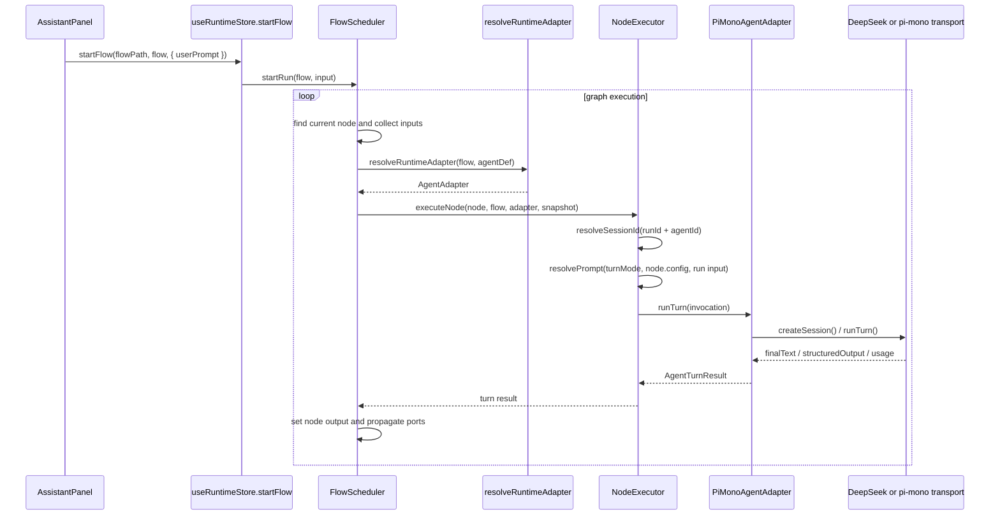

# ADR-002: Flow Runtime And Extension Model

**Status**: Accepted  
**Updated**: 2026-05-21  
**Scope**: Flow runtime, adapter extensions, local preview execution

## Companion Docs

Read this ADR together with:

- `docs/README.md` for document ownership and reading order
- `docs/specs/001-flow-node-contract.md` for the maintenance contract
- `docs/specs/002-runtime-binding.md` for the executable binding path
- `packages/flow-schema/src/schema/flow-definition.ts` for the canonical schema

## Context

Flow 区域需要同时满足几类需求：

- 类似 ComfyUI 的右键建点、拖拽、连线、端口约束
- 主 Agent -> Plan -> SubAgent -> 评分 -> 循环/结束 这类控制流
- Loader / Agent / Control 节点的统一规格定义
- 节点级数据调试：提示词源、输入值、输出值
- 为 pi-mono 预留接入面，但不把现有 contracts / engine 改成与某个供应商耦合

## Decision

采用“双层模型”而不是“每轮生成新 YAML 再解释”或者“每个节点各自随意驱动”。

### 持久化层：YAML / FlowDefinition 是唯一事实来源

- FlowDefinition 负责描述节点、边、端口、参数、布局、agent 绑定、自定义节点扩展
- 自定义节点通过 `flow.extensions.customNodeSpecs` 注入，不改内建 registry
- YAML 只表达静态拓扑和节点配置，不承载运行时状态

### 执行层：FlowScheduler + Node Driver 负责运行时跳转

- `loader.*` 节点负责产出数据端口
- `agent.*` 节点负责将输入、prompt、memory、tool policy 映射为一次 agent turn
- `control.*` 节点负责跳转、循环、完成判定
- 运行时跳转通过边和 `activeOutputHandle` 决定，而不是重写 YAML

### 调试层：UI 从运行时上下文派生 NodeDebugState

- 每个节点保留最近一次输入、输出端口值、最终文本、结构化输出、提示词源
- Inspector / Preview / BottomPreview 共用同一份运行时状态

## Current Binding Path

当前实现里，flow node 和具体 agent runtime 的绑定路径是：

`graph.nodes[*].agentId -> agents.agentDefs[*].agentId -> agentDef.adapterKind -> runtime adapter extension -> concrete transport`

```mermaid
flowchart LR
  Flow[FlowDefinition YAML] --> Node[graph.nodes[*]]
  Node --> AgentId[node.agentId]
  AgentId --> AgentDef[agents.agentDefs[*]]
  AgentDef --> AdapterKind[agentDef.adapterKind]
  AdapterKind --> Registry[runtime-adapter-registry]
  Registry --> Adapter[AgentAdapter instance]
  Adapter --> Transport{transport selection}
  Transport --> DeepSeek[DeepSeek-compatible transport]
  Transport --> PiMonoHttp[pi-mono HTTP transport]
```

当前默认 starter flow 走的是：

- `agent.main` / `agent.sub`
- `adapterKind: pi-mono`
- `adapterConfig.transport: deepseek`
- `@agentsflow/pi-mono-runtime` 内部再转到 DeepSeek 兼容 transport

这意味着默认 flow 已经走到了 `pi-mono` 扩展面，但不要求本地先存在一个真实的 pi-mono 服务端。

## Current Drive Path

当前本地预览模式的驱动链路如下：



这条链路有几个实现边界：

- `useRuntimeStore.startFlow(...)` 是 UI 入口
- `FlowScheduler` 决定节点执行顺序和端口传播
- `NodeExecutor` 负责 prompt 解析、session 复用、invocation 组装
- `AgentAdapter` 只负责一次 turn 的 provider 协议调用
- 运行结果进入 `RunContext` 和 UI debug state，不写回 YAML

## Current pi-mono Modes

当前 `@agentsflow/pi-mono-runtime` 支持两种模式：

- DeepSeek-compatible mode:
  Trigger: `adapterConfig.transport = deepseek` or a DeepSeek base URL.
  Behavior: synthetic `createSession()` plus `POST /chat/completions`.
  Typical use: browser preview and the default starter flow.

- pi-mono HTTP backend mode:
  Trigger: any other pi-mono-compatible base URL.
  Behavior: `POST /sessions`, `POST /turns`, plus optional abort and dispose.
  Typical use: a future real pi-mono service integration.

设计含义：

- 扩展点统一是 `adapterKind: pi-mono`
- 真实后端切换只发生在 transport 层
- core flow schema / engine 不需要因为供应商切换而改模型

## Why This Model

### 不选择“每个节点自己驱动当前 agent”

这样会导致：

- 控制流规则散落在节点实现里
- 循环、条件分支、终止条件难以统一观测和调试
- 图编辑器无法稳定判断某条边究竟是 control edge 还是 data edge

### 不选择“运行时生成 YAML 再执行”

这样会导致：

- 运行时状态和设计时拓扑混在一起
- diff / 保存 / 回放都变脏
- 一个 run 的临时决策会污染 flow 定义本身

### 选择“静态图 + 运行时 driver”

优点：

- FlowDefinition 可以稳定保存、版本化、审计
- driver 可以在不改 YAML 的情况下做循环、评估、跳转
- UI 可以对端口类型和数据流做静态约束
- pi-mono 只需要接 adapter，不需要侵入图模型

## Node Spec Contract

每个节点必须通过统一 NodeSpec 描述：

- `kind`: 稳定机器标识，例如 `loader.http-auth`、`agent.main`
- `category`: palette / 统计 / 视觉分组
- `inputPorts` / `outputPorts`: 明确 control/data 端口和 dataType
- `params`: 统一参数表单协议
- `visible`: 是否出现在右键菜单
- `maxInstances`: 节点实例上限，例如主 Agent 可限制为 1

### Port Rules

- `flow` 端口代表控制流，不承载业务数据
- 非 `flow` 端口代表数据流，会被标记为 `dataEdge`
- data 端口必须做类型兼容校验
- 非 `flow` 输入端口默认只允许一个上游来源，避免流程混乱

### Param Rules

参数表单统一通过 `ParamDef` 渲染，当前支持：

- `string`
- `number`
- `boolean`
- `select`
- `multiselect`
- `path`
- `url`
- `secret`
- `json`
- `code`

## Custom Node Extension

Flow-local 自定义节点定义在：

```yaml
extensions:
  customNodeSpecs:
    - kind: agent.review
      label: Review Agent
      category: Agent
      description: Review and score a draft
      icon: bot
      inputPorts:
        - portId: in
          dataType: flow
        - portId: draft
          dataType: string
      outputPorts:
        - portId: out
          dataType: flow
        - portId: score
          dataType: score
      params:
        - paramId: rubric
          paramType: code
          required: false
      tags: [agent, review]
      visible: true
      maxInstances: 0
```

解释规则：

- 编辑器启动时将 built-in specs 与 `customNodeSpecs` 合并成当前 flow registry
- 右键菜单、节点渲染、连线约束、Inspector 表单都使用同一份 registry
- 因为扩展是 flow-local 的，所以不会污染别的 flow

## pi-mono Extension Contract

pi-mono 不应直接侵入 core package。推荐做独立包，例如：

- `@agentsflow/pi-mono-runtime`
- `@agentsflow/pi-mono-desktop`

最小接入方式：实现 `AgentAdapter`，并注册到运行时扩展点。

```ts
registerRuntimeAdapterExtension({
  adapterKind: "pi-mono",
  displayName: "pi-mono",
  createAdapter: ({ agentDef, flow }) =>
    new PiMonoAgentAdapter({
      model: agentDef.modelProfile?.model,
      temperature: agentDef.modelProfile?.temperature,
      adapterConfig: agentDef.adapterConfig,
      flowName: flow.meta.name,
    }),
});
```

### Required pi-mono Behavior

- 通过 `createSession()` 建立会话
- `runTurn()` 支持 `turnMode`:
  - `plan`
  - `normal`
  - `evaluate`
  - `summarize`
- 读取 `invocation.metadata.adapterConfig`
- 支持结构化输出（至少 evaluate / plan）
- 可选支持 tools / memory / delegation

## Engine Changes Required For Real Adapters

为了让真实 adapter 可用，engine 必须：

- 在首次使用某个 `runId + agentId` 时创建 session
- 在 invocation 中透传 adapterConfig / modelProfile metadata
- run 结束后清理 session

当前代码已经按这个方向调整。

## Debug Contract

UI 调试面板按节点展示：

- Prompt Sources
- Inputs
- Output Ports
- Final Text
- Structured Output
- Last Event / Status

这层是运行时派生数据，不写回 YAML。

## Consequences

正面影响：

- flow 设计和 flow 运行解耦
- 自定义节点和 pi-mono 都有稳定扩展点
- 调试面板可以统一观察 plan/execute/evaluate loop

负面影响：

- 运行时需要维护额外的 debug store
- 自定义节点只是“规格扩展”，真正执行语义仍需 node driver / adapter 支持
- web 本地运行时和桌面生产运行时需要共享协议，但可以有不同宿主实现
