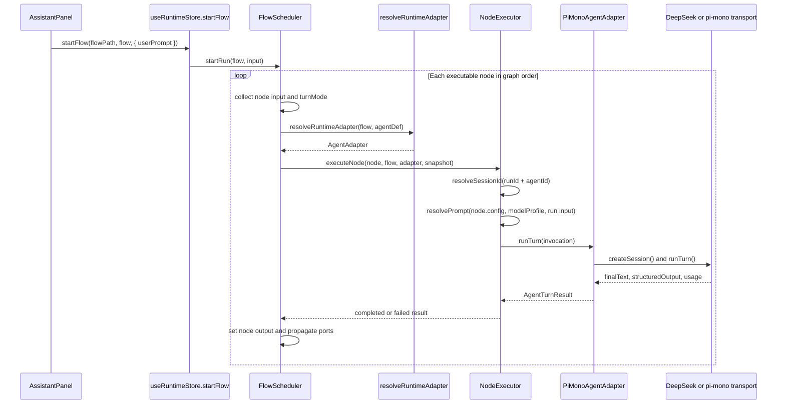

# Flow / Node Contract

## Status
Active

## Purpose
This document turns the flow-area implementation into an explicit maintenance contract.

Use it together with:

- `docs/adr/002-flow-runtime-extension.md` for architecture decisions
- `docs/specs/002-runtime-binding.md` for the executable binding path and runtime drive sequence
- `packages/flow-schema/src/schema/flow-definition.ts` for the canonical schema
- `packages/node-spec-registry/src/specs.ts` for built-in node kinds

The goal is to keep three layers aligned:
- design-time YAML / `FlowDefinition`
- runtime scheduling / adapter execution
- UI inspection / debug rendering

## Source Of Truth

### Static definition
`FlowDefinition` is the only persisted source of truth.

It owns:
- `meta`: identity and versioning
- `agents.agentDefs`: available agent configurations
- `graph.nodes`, `graph.edges`, `graph.startNodeId`: topology
- `runtime`: scheduler defaults and budgets
- `layout`: canvas positions, viewport, node-agent binding overrides
- `extensions.customNodeSpecs`: flow-local node kind extensions

Rules:
- Runtime state must not be written back into YAML.
- Temporary loop decisions must stay in `RunContext` / debug state.
- Typed fixtures in this repo should include `extensions: { customNodeSpecs: [] }` explicitly, because the schema defaults make `extensions` effectively present in the inferred TypeScript type.

### Runtime execution
`FlowScheduler` and node drivers own execution order.

Rules:
- Nodes do not rewrite graph YAML at runtime.
- Control flow is chosen from edges and active output handles.
- Real adapters are isolated behind `AgentAdapter`.

### UI debug state
Inspector, left preview, and bottom run preview must render from one runtime-derived state model.

Rules:
- Prompt sources, inputs, outputs, and latest status are derived data.
- Debug data is read-only with respect to YAML.

## Binding Model

### Executable binding path
The executable binding path is:

`graph.nodes[*].agentId -> agents.agentDefs[*].agentId -> agentDef.adapterKind -> runtime adapter extension -> concrete adapter transport`

```mermaid
flowchart LR
  Node[graph.nodes[*]] --> AgentId[node.agentId]
  AgentId --> AgentDef[agents.agentDefs[*]]
  AgentDef --> AdapterKind[agentDef.adapterKind]
  AdapterKind --> Registry[runtime-adapter-registry]
  Registry --> Adapter[AgentAdapter instance]
  Adapter --> Transport[provider transport]
```

Rules:
- `graph.nodes[*].agentId` is the executable source of truth for mapping a node to an agent definition.
- Runtime resolution must look up `agents.agentDefs[*]` by `agentId` before selecting an adapter.
- `agentDef.adapterKind` is the only field that chooses the runtime adapter extension.
- `layout.nodeBindings` is descriptive UI/layout metadata and must not replace runtime lookup unless the engine explicitly adopts it in the future.
- `layout.nodeBindings[*].overrides` is currently reserved metadata; the runtime does not automatically merge these overrides into `agentDef` execution.

### Current pi-mono binding
The default starter flow currently binds `agent.main` and `agent.sub` nodes to `adapterKind: pi-mono`, then lets `@agentsflow/pi-mono-runtime` choose one of two transport styles:

- DeepSeek-compatible transport when `adapterConfig.transport = deepseek` or the resolved base URL points at DeepSeek.
- pi-mono HTTP transport when a pi-mono-compatible backend exposes `/sessions` and `/turns`.

Configuration precedence for the pi-mono runtime is:

1. Flow or agent `adapterConfig`
2. Adapter constructor options
3. `VITE_AGENTSFLOW_PI_MONO_*` or `AGENTSFLOW_PI_MONO_*`
4. `VITE_AGENTSFLOW_LLM_*` fallback values

## Runtime Drive Sequence

The local preview runtime drives a flow through the following chain.



Rules:
- `useRuntimeStore.startFlow(...)` is the UI entry point for local preview runs.
- `FlowScheduler` owns graph traversal, node dispatch, and port propagation.
- `NodeExecutor` owns prompt resolution, session reuse, invocation shaping, and adapter lifecycle events.
- Session reuse is keyed by `runId + agentId`, so multiple nodes can share one adapter session when they target the same agent.
- `turnMode` is determined by node configuration and passed through the invocation to the adapter.
- Runtime outputs are written to `RunContext` and then re-derived into debug and timeline state; they are not written back into YAML.

## Node Spec Contract
Every node kind must be expressible as a `NodeSpec`.

Required fields:
- `kind`: stable machine identifier in `domain.variant` form such as `loader.local-dir`, `agent.main`, `control.plan-loop`
- `label`: user-facing name
- `category`: palette group; current built-ins use `Loader`, `Agent`, `Control`
- `description`: short behavior contract
- `icon`: stable palette icon identifier
- `inputPorts`, `outputPorts`: explicit port list
- `params`: editable configuration fields
- `visible`: whether the kind appears in the creation menu
- `maxInstances`: per-flow ceiling, where `0` means unlimited

Recommended rules:
- Prefer creating a new `kind` when behavior meaning changes materially.
- Do not overload one `kind` with incompatible port contracts.
- Keep labels user-oriented and keep `kind` stable for serialization.

## Port Contract

### Port meaning
- `flow` is a control signal only.
- Any non-`flow` port is a data port.
- Data ports must declare an explicit `dataType`.

### Connection rules
- `flow -> flow` is a control edge.
- Any connection involving a non-`flow` port becomes a data edge.
- Data edges must pass `isPortTypeCompatible(...)` validation.
- A non-`flow` input port accepts only one upstream edge.
- A node cannot connect to itself.
- Duplicate source/target/handle combinations are invalid.

### Port precedence
Registry ports are defaults.

If a node instance defines `inputPorts` or `outputPorts`, the instance-level ports take precedence over the registry spec for:
- handle rendering
- connection validation
- inspector display
- runtime port lookups

This rule allows flow-local specialization without mutating built-in registry entries.

## Parameter Contract
Parameters are rendered from `ParamDef` and are the only supported editable node configuration surface.

Supported parameter types:
- `string`
- `number`
- `boolean`
- `select`
- `multiselect`
- `path`
- `url`
- `secret`
- `json`
- `code`

Rules:
- Use `group` to keep complex forms maintainable.
- Put provider-specific freeform settings in `adapterConfig`, not scattered ad hoc fields.
- Use node `config` for instance values and `params` for schema only.

## Custom Node Extension Contract
Flow-local custom node kinds live under `extensions.customNodeSpecs`.

Example:

```yaml
extensions:
  customNodeSpecs:
    - kind: agent.review
      label: Review Agent
      category: Agent
      description: Review and score a draft
      icon: bot
      inputPorts:
        - portId: in
          dataType: flow
        - portId: draft
          dataType: string
      outputPorts:
        - portId: out
          dataType: flow
        - portId: score
          dataType: score
      params:
        - paramId: rubric
          paramType: code
          required: false
      visible: true
      maxInstances: 0
```

Merge rules:
- Built-in registry entries load first.
- Flow-local custom specs are merged on top of the built-ins for the current flow.
- The merged registry must be shared by the canvas, context menu, inspector, and connection validator.
- A custom spec only defines structure; it does not automatically make the engine executable.

When a new kind needs runtime semantics, add one of these:
- a node driver in `@agentsflow/flow-engine`
- an adapter-backed execution path for `agent.*`

## Runtime Adapter Contract
Adapters such as pi-mono must extend the system through the runtime adapter registry, not by patching core packages.

Recommended packages:
- `@agentsflow/pi-mono-runtime`
- `@agentsflow/pi-mono-desktop`

Required behavior:
- implement `AgentAdapter`
- create or reuse a session through `createSession()`
- support `runTurn()` for at least `plan`, `normal`, `evaluate`, `summarize`
- consume `invocation.metadata.adapterConfig`
- tolerate flow-level and node-level overrides coming from `modelProfile`
- dispose session state when the run completes

Local preview integration point:

```ts
registerRuntimeAdapterExtension({
  adapterKind: "pi-mono",
  displayName: "pi-mono",
  createAdapter: ({ flow, agentDef }) =>
    new PiMonoAgentAdapter({
      flowName: flow.meta.name,
      adapterConfig: agentDef.adapterConfig,
      model: agentDef.modelProfile?.model,
      temperature: agentDef.modelProfile?.temperature,
    }),
});
```

## Debug Contract
Each run should be observable per node through one normalized state model.

Minimum debug fields:
- node status: `idle | running | completed | failed`
- resolved prompt sources
- resolved inputs
- output-port values
- final text
- structured output when available
- latest event type

Rules:
- Debug panels show derived runtime state only.
- Prompt sources should distinguish `agent`, `node`, `run-input`, and `external-file`.
- UI surfaces must not invent independent debug models for the same run.

## Authoring Checklist
When introducing a new node kind or runtime integration:

1. Add or extend the node structure contract in `flow-schema` if the serialized shape changes.
2. Register the built-in `NodeSpec`, or define a flow-local `customNodeSpec` if the scope is one flow.
3. Ensure the merged registry is enough to render ports and parameters correctly.
4. Implement runtime behavior in `flow-engine` or the relevant adapter extension.
5. Verify the node participates correctly in Inspector, left preview, and bottom run preview.
6. Add or update fixtures and tests when execution semantics change.

## Non-Goals
- This document does not define provider-specific protocol details.
- This document does not replace ADR 002; it operationalizes it.
- This document does not require every custom node spec to be executable immediately.