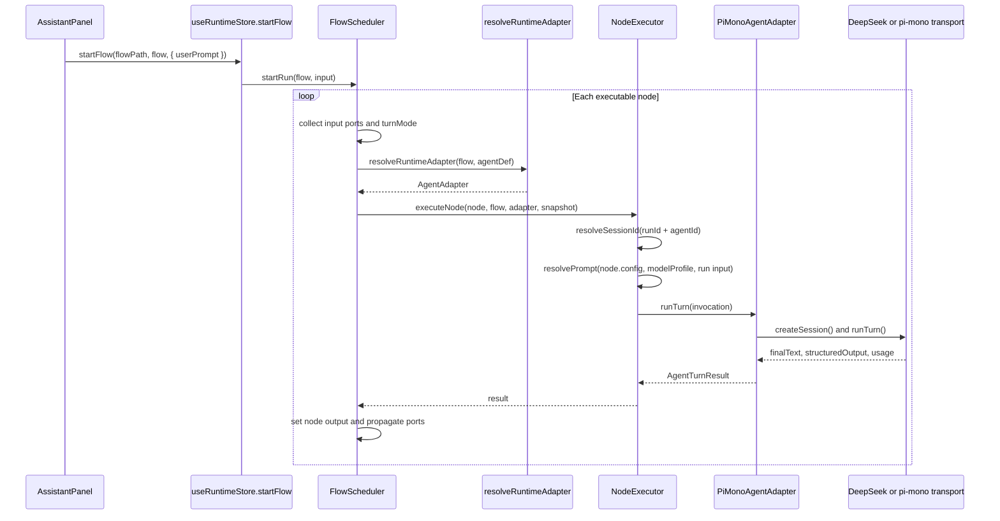

# Runtime Binding Spec

## Status

Active

## Purpose

This document describes the current executable binding path from a flow node to a concrete runtime transport.

Use it when you need to understand or change:

- how `graph.nodes[*]` selects an agent
- how `agents.agentDefs[*]` selects an adapter
- how `adapterKind: pi-mono` is resolved in local preview runtime
- how the default starter flow reaches DeepSeek without patching core packages

Read it together with:

- `docs/adr/002-flow-runtime-extension.md` for the architecture decision
- `docs/specs/001-flow-node-contract.md` for the structural node and runtime contract
- `packages/flow-schema/src/schema/flow-definition.ts` for the serialized schema

## Scope

This spec documents the current implementation, not a future target architecture.

It is intentionally precise about what is executable today versus what is only descriptive metadata.

## Binding Path

The executable binding path is:

`graph.nodes[*].agentId -> agents.agentDefs[*].agentId -> agentDef.adapterKind -> runtime adapter extension -> concrete adapter transport`

```mermaid
flowchart LR
    Node[graph.nodes[*]] --> AgentId[node.agentId]
    AgentId --> AgentDef[agents.agentDefs[*]]
    AgentDef --> AdapterKind[agentDef.adapterKind]
    AdapterKind --> Registry[resolveRuntimeAdapter]
    Registry --> Adapter[AgentAdapter instance]
    Adapter --> Transport{resolveTransport}
    Transport --> DeepSeek[DeepSeek-compatible transport]
    Transport --> PiMonoHttp[pi-mono HTTP transport]
```

Rules:

- `node.agentId` is the executable source of truth for choosing an agent definition.
- `agentDef.adapterKind` is the executable source of truth for choosing a runtime adapter extension.
- `layout.nodeBindings` is descriptive metadata for layout-aware tooling and documentation.
- `layout.nodeBindings[*].overrides` is currently reserved metadata and is not merged into runtime execution.

## Local Preview Drive Sequence

In web and studio local preview, a run is driven through the following call chain.



Responsibilities:

- `useRuntimeStore.startFlow(...)` is the UI entry point.
- `FlowScheduler` owns graph traversal, node dispatch, and port propagation.
- `NodeExecutor` owns prompt resolution, session reuse, and invocation shaping.
- `AgentAdapter` owns provider-specific turn execution.
- `RunContext` stores runtime outputs, and UI debug state is derived from that runtime state.

## Current pi-mono Runtime Modes

`@agentsflow/pi-mono-runtime` currently supports two transport modes behind the same `adapterKind: pi-mono` extension point.

| Mode | Trigger | Transport Behavior | Typical Use |
|------|---------|--------------------|-------------|
| DeepSeek-compatible | `adapterConfig.transport = deepseek` or a DeepSeek base URL | synthetic `createSession()` and `POST /chat/completions` | browser preview and default starter flow |
| pi-mono HTTP backend | any other pi-mono-compatible base URL | `POST /sessions`, `POST /turns`, optional abort and dispose | future real pi-mono service integration |

Design implications:

- switching providers should not require changing `FlowScheduler` or the flow graph model
- the stable extension boundary is `adapterKind: pi-mono`
- transport switching happens inside `@agentsflow/pi-mono-runtime`, not in flow-schema or flow-engine

## Default Starter Flow Binding

The default starter flow currently binds:

- `main-prompt` -> `main-agent`
- `sub-execute` -> `sub-agent`
- `main-evaluate` -> `main-agent`

The matching `agentDefs` currently use:

- `adapterKind: pi-mono`
- `adapterConfig.transport: deepseek`
- `modelProfile.model: deepseek-v4-flash`

That means the default starter flow already exercises the pi-mono extension path, while still using the DeepSeek-compatible transport in environments that do not have a real pi-mono backend.

## Configuration Precedence

For the current pi-mono runtime, configuration resolves in this order:

1. flow or agent `adapterConfig`
2. adapter constructor options
3. `VITE_AGENTSFLOW_PI_MONO_*` or `AGENTSFLOW_PI_MONO_*`
4. `VITE_AGENTSFLOW_LLM_*` fallback values

This precedence allows the default starter flow to run in browser preview with the repo-level DeepSeek environment file, while still permitting a future real pi-mono backend override.

## Extended Binding Path (with .agents-flow)

When a node specifies `agentRef`, the binding path extends through the `PromptAssetManifest`:

```mermaid
flowchart LR
    Node[graph.nodes[*]] --> AgentRef{node.agentRef?}
    AgentRef -->|present| Manifest[PromptAssetManifest]
    Manifest --> ResolvedAgent[ResolvedAgentAsset]
    ResolvedAgent --> AdapterKind[agent.adapterKind]
    AdapterKind --> Registry[resolveRuntimeAdapter]
    Registry --> Adapter[AgentAdapter instance]
    Adapter --> Transport{resolveTransport}
    AgentRef -->|absent| AgentId[node.agentId]
    AgentId --> AgentDef[agents.agentDefs[*]]
    AgentDef --> AdapterKind2[agentDef.adapterKind]
    AdapterKind2 --> Registry2[resolveRuntimeAdapter]
    Registry2 --> Adapter2[AgentAdapter instance]
    Adapter2 --> Transport2{resolveTransport}
```

Rules:

- When `node.agentRef` is present, resolution goes through the `PromptAssetManifest`.
- When `node.agentRef` is absent, resolution falls through to the existing `agentId → agentDefs` path.
- Both paths converge at `adapterKind → runtime adapter extension → transport`.
- `agentRef` takes precedence over `agentId` when both are present.

Full specification: `docs/specs/003-agents-flow-repo-spec.md`.

## Non-Goals

- This document does not make `layout.nodeBindings[*].overrides` executable.
- This document does not define the wire protocol of a future real pi-mono service beyond the currently expected endpoints.
- This document does not replace ADR 002 or the flow node contract; it narrows the runtime binding topic into one maintenance surface.